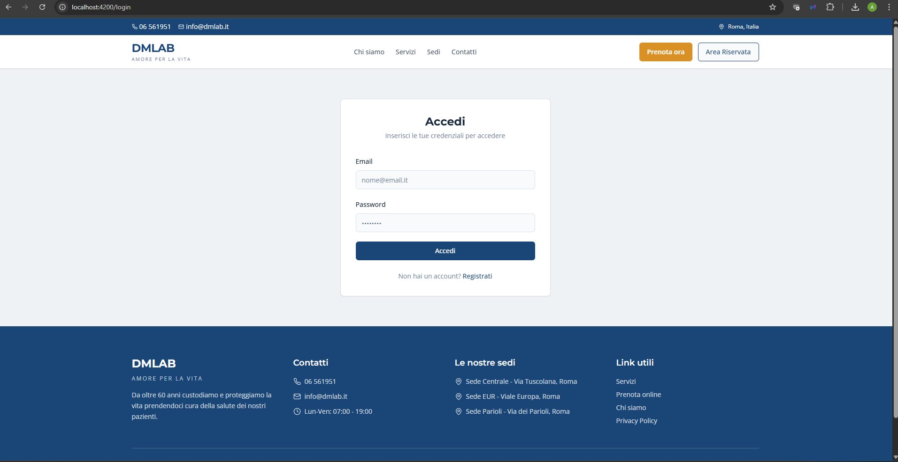
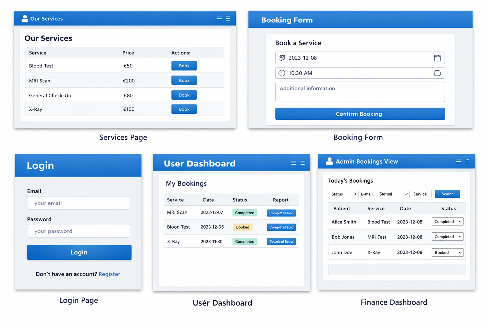

# Piattaforma digitale per DMlab

## Contesto organizzativo

**DMlab** è una rete di ambulatori polispecialistici presenti a Roma e Ostia. L’azienda opera da oltre sessant’anni nel settore sanitario e combina **innovazione medica ed esperienza clinica** per offrire diagnostica per immagini all’avanguardia, laboratori di analisi d’eccellenza e percorsi di prevenzione personalizzati per ogni fase della vita【600336700924256†L437-L441】. Presso ogni centro è disponibile un ecosistema di professionisti che rispondono in tempi rapidi perché la salute non può aspettare.

Nel 2025 DMlab ha lanciato una **nuova piattaforma digitale** che semplifica l’accesso alle prestazioni sanitarie【600336700924256†L485-L495】. Attraverso il sito **dmlab.it** i pazienti possono **prenotare e acquistare online visite, esami diagnostici e pacchetti di prevenzione**, scegliendo lo specialista, la sede, la data e l’orario in tempo reale. Il sistema consente di arrivare in struttura con le pratiche già completate, riducendo i tempi di attesa in accettazione e rendendo la prevenzione parte della quotidianità. Questo progetto di digitalizzazione è in linea con i valori aziendali di eccellenza, innovazione e attenzione al paziente.

## Scenario applicativo

L’obiettivo del project work è la realizzazione di una **web app full‑stack basata su API** che supporti le principali funzionalità della piattaforma DMlab. Si è scelto di implementare una **single page application Angular** che interagisce con un backend **Flask** tramite API RESTful. I dati sono persistiti su **PostgreSQL** tramite **SQLAlchemy**, mentre l’autenticazione e l’autorizzazione usano **JSON Web Token (JWT)** con ruoli `USER` e `ADMIN`.

Le funzionalità richieste si suddividono fra utente (paziente) e amministratore (segreteria):

| Utente (USER) | Amministratore (ADMIN) |
|---------------|------------------------|
| Consultare il catalogo dei servizi | Visualizzare le prenotazioni del giorno con filtri per stato, email e servizio |
| Prenotare un servizio scegliendo data, ora e note | Aggiornare lo stato delle prenotazioni (BOOKED, CONFIRMED, COMPLETED, CANCELLED) |
| Accedere all’area riservata con autenticazione | Visualizzare una **dashboard economico‑finanziaria** con incassi aggregati per giorno, settimana e mese |
| Visualizzare l’elenco delle proprie prenotazioni e il relativo stato | |
| Scaricare i referti (PDF) associati alle prenotazioni completate | |

## Progettazione del sistema

### Architettura generale

La soluzione adotta una **architettura client‑server** modulare, in cui il frontend e il backend possono essere distribuiti indipendentemente. L’applicazione segue i principi REST: tutte le risorse (servizi, prenotazioni, pagamenti, referti) sono esposte attraverso endpoint sotto `/api/v1/…`. L’uso di JWT consente di autenticare l’utente una sola volta ed includere il token nelle richieste successive.

### Diagrammi UML ed ER

I diagrammi sono stati realizzati in PlantUML e sono disponibili nella cartella `docs/diagrams/`. I file `.puml` possono essere esportati in immagini utilizzando qualsiasi tool compatibile con PlantUML (es.: `java -jar plantuml.jar <file>.puml`). Di seguito una sintesi dei diagrammi principali:

* **Use Case Diagram** – rappresenta gli attori (`User`, `Admin`) e i casi d’uso principali della piattaforma (consultare servizi, prenotare, visualizzare prenotazioni, scaricare referti, gestione prenotazioni giornaliere, dashboard incassi).
* **Class Diagram** – mostra le entità del dominio (`User`, `Service`, `Booking`, `Payment`, `Report`) con attributi e relazioni uno‑a‑molti fra utente/servizio e prenotazioni, e relazioni uno‑a‑uno per pagamenti e referti.
* **Sequence Diagrams** – illustrano il flusso di messaggi durante le operazioni di login, prenotazione, download referto e gestione delle prenotazioni da parte dell’amministratore. Questi diagrammi evidenziano come l’Angular client invii richieste HTTP al backend, come il backend interagisca con il database e come vengano restituite le risposte.
* **ERD** – definisce lo schema relazionale implementato in PostgreSQL con chiavi primarie, chiavi esterne e cardinalità. Le tabelle create sono `users`, `services`, `bookings`, `payments` e `reports`.

### Scelte architetturali

* **Backend Flask** – è stato utilizzato il pattern *application factory* per permettere una configurazione flessibile. Le dipendenze principali sono Flask‑SQLAlchemy per l’accesso ai dati, Flask‑Migrate per le migrazioni e Flask‑JWT‑Extended per la gestione dei token. Ogni area funzionale è incapsulata in un blueprint (`auth`, `services`, `bookings`, `reports` e `finance`). La validazione degli input è affidata a Marshmallow.
* **Database** – PostgreSQL è gestito tramite Docker Compose. Le entità sono modellate con SQLAlchemy e i rapporti corrispondono al diagramma ER. Il seeding genera un amministratore, due utenti, nove servizi con prezzi, quindici prenotazioni distribuite su diverse date, pagamenti e referti.
* **Frontend Angular** – l’applicazione è suddivisa in componenti per ogni pagina (login, registrazione, lista servizi, form di prenotazione, area utente, vista prenotazioni admin e dashboard incassi). Il modulo di routing definisce le rotte e i *guard* proteggono le sezioni riservate in base al ruolo. Un interceptor inserisce automaticamente il token JWT nelle chiamate HTTP. L’interfaccia è realizzata con **Angular Material** per assicurare un aspetto coerente e accessibile.
* **API documentation** – la specifica OpenAPI (`docs/api/openapi.yaml`) descrive dettagliatamente ogni endpoint, le request e le response, i codici di stato e gli schemi dei messaggi. Una swagger UI viene servita dal backend all’endpoint `/docs` per consentire di esplorare e testare le API.

## Implementazione dell’applicazione

L’implementazione è stata organizzata in due repository distinti (`backend` e `frontend`) sotto la cartella `dmlab-project`. Di seguito alcuni snippet significativi:

### Decoratore `role_required` per i permessi

Nel file `backend/app/routes/bookings.py` viene definito un decoratore personalizzato che verifica il ruolo dell’utente loggato prima di consentire l’accesso ad un endpoint amministrativo:

```python
def role_required(required_role: Role) -> Callable[[F], F]:
    """Decorator to restrict access to users with a given role."""
    def decorator(func: F) -> F:
        @wraps(func)
        def wrapper(*args, **kwargs):
            user_id = get_jwt_identity()
            user = User.query.get(user_id)
            if not user or user.role != required_role:
                return {"message": "Forbidden"}, 403
            return func(*args, **kwargs)
        return wrapper
    return decorator
```

Questo approccio evita duplicazione di codice e rende immediato proteggere un endpoint con `@role_required(Role.ADMIN)`.

### Aggregazione degli incassi

Nel file `backend/app/routes/finance.py` la rotta `GET /admin/finance` calcola gli incassi aggregati per giorno, settimana o mese. Vengono filtrati i pagamenti all’interno di un intervallo temporale e raggruppati tramite una chiave calcolata:

```python
def group_key(dt: datetime, period: str) -> str:
    if period == "daily":
        return dt.date().isoformat()
    if period == "weekly":
        year, week, _ = dt.isocalendar()
        return f"{year}-W{week:02d}"
    if period == "monthly":
        return dt.strftime("%Y-%m")

@finance_bp.get("")
@jwt_required()
def get_finance():
    # … verifica ruolo ADMIN …
    payments = query.all()
    aggregated: Dict[str, float] = defaultdict(float)
    for payment in payments:
        key = group_key(payment.paid_at, period)
        aggregated[key] += payment.amount
    result = [
        {"period": k, "total_amount": v} for k, v in sorted(aggregated.items())
    ]
    return finance_item_schema.dump(result), 200
```

### Interceptor JWT in Angular

Nel frontend (`src/app/shared/token.interceptor.ts`) l’interceptor intercetta tutte le richieste HTTP e inserisce il token nel header `Authorization` se presente:

```ts
export class TokenInterceptor implements HttpInterceptor {
  constructor(private auth: AuthService) {}

  intercept(req: HttpRequest<any>, next: HttpHandler): Observable<HttpEvent<any>> {
    const token = this.auth.getToken();
    if (token) {
      const cloned = req.clone({
        setHeaders: { Authorization: `Bearer ${token}` }
      });
      return next.handle(cloned);
    }
    return next.handle(req);
  }
}
```

### Gestione prenotazioni lato admin

L’interfaccia amministrativa consente di filtrare le prenotazioni del giorno per stato, email utente e nome del servizio. Per ogni riga viene mostrato un menù a tendina che consente di aggiornare rapidamente lo stato della prenotazione. Questo è possibile grazie all’invocazione dell’endpoint `PATCH /admin/bookings/{id}` direttamente dal front‑end.

## Processo di sviluppo

1. **Analisi dei requisiti** – lettura del documento di contesto e del template fornito; ricerca sul sito ufficiale DMlab per comprendere missione, servizi offerti e iniziative digitali【600336700924256†L437-L441】【600336700924256†L485-L495】.
2. **Definizione dello stack e progettazione** – scelta di Angular per il frontend e Flask per il backend; progettazione del dominio con diagrammi UML e ER; definizione dell’API e delle rotte necessarie.
3. **Setup dei repository** – creazione della struttura di progetto con cartelle separate per backend e frontend, script per il seeding, file di configurazione e Docker Compose per l’orchestrazione.
4. **Implementazione backend** – sviluppo dell’application factory, dei modelli SQLAlchemy e dei blueprint per ogni area; implementazione dell’autenticazione JWT, dei filtri basati sui ruoli e degli endpoint richiesti; scrittura dello script di seeding.
5. **Implementazione frontend** – creazione dello scheletro Angular con routing, componenti per ogni pagina, servizi per consumare l’API, *guards* per proteggere le rotte e *interceptor* per il token; utilizzo di Angular Material per l’interfaccia.
6. **Documentazione** – redazione della specifica OpenAPI, predisposizione dei diagrammi PlantUML e compilazione del presente report con spiegazione delle scelte e degli snippet di codice più significativi.
7. **Test funzionale** – esecuzione dell’applicazione tramite Docker Compose; verifica delle funzionalità richieste con gli utenti dummy creati dal seed; raccolta degli screenshot delle principali pagine e flussi.

## Test funzionale e screenshot

Di seguito sono riportati alcuni screenshot generati sulla base dell’interfaccia progettata. Ogni immagine è collocata nella cartella `docs/screenshots/` del progetto.

| Pagina / Funzionalità | Screenshot |
|----------------------|-----------|
| **Login** – form di autenticazione con email e password |  |
| **Lista servizi** – tabella dei servizi disponibili con nome, prezzo e pulsante “Prenota” |  |
| **Form prenotazione** – selezione data, ora e note per prenotare un servizio |  |
| **Area utente** – visualizzazione delle prenotazioni proprie con possibilità di scaricare i referti |  |
| **Vista amministrativa prenotazioni** – elenco delle prenotazioni del giorno con filtri e modifica stato |  |
| **Dashboard incassi** – riepilogo degli incassi aggregati per periodo con filtri di intervallo |  |

I dati raffigurati sono ottenuti dal seeding iniziale: l’amministratore può accedere con `admin@dmlab.it` / `adminpass`, mentre gli utenti demo `alice@dmlab.it` e `bob@dmlab.it` hanno password `password`. Nel test sono state effettuate prenotazioni su diversi servizi e date, verificate nella dashboard economica.

## Conclusioni

Il project work ha dimostrato come digitalizzare i processi di prenotazione e gestione delle prestazioni sanitarie fornendo un’esperienza utente moderna e intuitiva. Grazie all’architettura API‑based è possibile integrare ulteriori applicazioni, come app mobile, sistemi di analisi dati o servizi di pagamento esterni. L’utilizzo di Docker Compose e di seed predefiniti permette di avviare rapidamente l’ambiente e testare tutte le funzionalità senza configurazioni complesse. Future estensioni potrebbero includere la gestione di pagamenti online reali, notifiche via email/SMS, esportazione dei dati e integrazione con sistemi regionali di prenotazione.